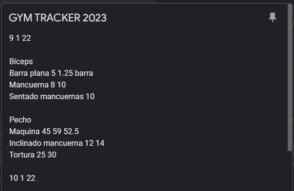

# GymTracker
## Que es
Gestiona tus datos del gym, marcate objetivos y haz un seguimiento.
## Integracion con Keep y texto
Pasa tus datos del gym desde una nota de Keep a una aplicación de seguimiento(no tiene mucho sentido)
### Como es la estructura de la nota mas o menos

Primero se define la fecha, luego el grupo muscular y el ejercicio y por ultimo los datos del ejercicio realizado. Luego se repite el proceso para cada ejercicio. Se puede poner un comentario al final de la nota.

## Generacion de un json

Tenemos un boton que genera un json con los datos de la nota. Este json se puede copiar y pegar en la aplicacion.

## Generacion de un informe en un rango de fechas

Tenemos un boton que genera un informe en un rango de fechas. Este informe se puede copiar y pegar en la aplicacion.

## Generacion de un listado de objetivos

Se pueden marcar metas a las que quieres llegar.
